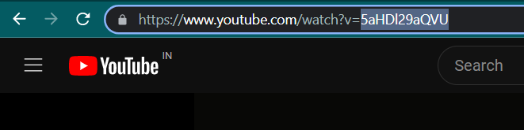
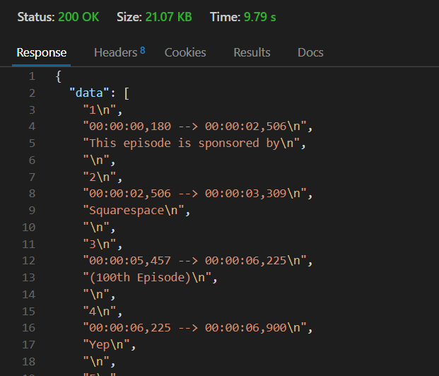

# Transcriber

## About
This api is made using youtube_transcript_api. It fetches captions from the youtube itself.
By default it fetches manual captions in 'en'. In case the captions are not available, it fetches the auto-generated captions in 'en'.
You can also specify in which language you want the captions. Going through the documentation of the [youtube_transcript_api](https://pypi.org/project/youtube-transcript-api/), you can find that you can even translate the captions from one language to the other.

## Deployment
After cloning this repo, install all the dependencies
```bash
    pip install -r requirements.txt
```
Requirement also includes gunicorn which helps in deploying the project on [fly.io](https://fly.io/). This package is optional.

## Setting Up
After running this script. 
1. Copy the video id of the YouTube video you want. 


2. Send a GET request.


3. 
